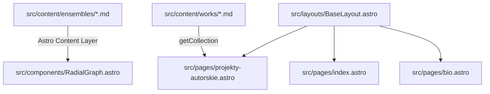

[Strona główna](../README.md) > [src](README.md)

---

# `src/` (Kod Źródłowy)

* **Status:** 🔴 `[WYMAGANY]`

Katalog `src/` stanowi rdzeń projektu portfolio Kacpra Czeczota opartego na frameworku Astro.

## 📂 Struktura katalogów w `src/`

| Katalog | Opis modułu |
| :--- | :--- |
| [**`components/`**](components/README.md) | Komponenty widokowe, diagram bąbelkowy, panel boczny, nawigacja i stopka |
| [**`content/`**](content/README.md) | Schematy Zod i zbiory danych Content Collections (`ensembles`, `works`) |
| [**`layouts/`**](layouts/README.md) | Główny layout strony `BaseLayout.astro`, konfiguracja meta-tagów i SEO |
| [**`pages/`**](pages/_README.md) | Trasy i podstrony serwisu (`index.astro`, `scena-i-zespoly.astro`, `projekty-autorskie.astro`, `bio.astro`) |
| **`styles/`** | Globalny arkusz stylów CSS (`global.css`) |
| [**`utils/`**](utils/README.md) | Narzędzia pomocnicze (`cms.ts` – obsługa base URL i mediów CMS) |

---

## 🧭 Przepływ danych w aplikacji

